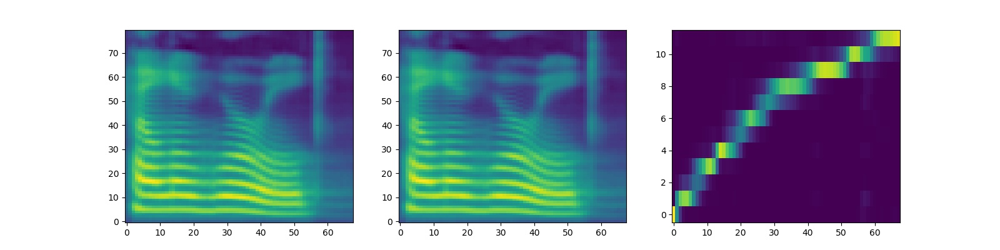

# FastSpeech-Pytorch
The Implementation of FastSpeech Based on Pytorch.

## Model
<div align="center">

</div>

## My Blog
- [FastSpeech Reading Notes](https://zhuanlan.zhihu.com/p/67325775)
- [Details and Rethinking of this Implementation](https://zhuanlan.zhihu.com/p/67939482)

## Train
1. Download and extract [LJSpeech dataset](https://keithito.com/LJ-Speech-Dataset/).
2. Put LJSpeech dataset in `data`.
3. Run `preprocess.py`.
4. If you want to get the target of alignment before training(It will speed up the training process greatly), you need download the pre-trained Tacotron2 model published by NVIDIA [here](https://drive.google.com/uc?export=download&confirm=XAHL&id=1c5ZTuT7J08wLUoVZ2KkUs_VdZuJ86ZqA).
5. Now I provide LJSpeech's alignments calculated by Tacotron2 in `alignment_targets.zip`. If you want to use it, just unzip it and don't need the steps of 6, 7.
6. Put the pre-trained Tacotron2 model in `Tacotron2/pre_trained_model`
7. Run `alignment.py`, it will take 7 hours on NVIDIA RTX2080ti.
8. Change `pre_target = True` in `hparam.py`.
9. Run `train.py`.
10. This Implementation supports data-parallel now.
11. The tacotron2 outputs of mel spectrogram and alignment are shown as follow:
<div align="center">

</div>

## Dependencies
- python 3.6
- CUDA 10.0
- pytorch 1.1.0
- numpy 1.16.2
- scipy 1.2.1
- librosa 0.6.3
- inflect 2.1.0
- matplotlib 2.2.2

## Notes
- If you don't prepare the target of alignment before training, the process of training would be very long.
- In the paper of FastSpeech, authors use pre-trained Transformer-TTS to provide the target of alignment. I didn't have a well-trained Transformer-TTS model so I use Tacotron2 instead.
- If you want to use another model to get targets of alignment, you need rewrite `alignment.py`.
- The returned value of `alignment.py` is a tensor whose value is the multiple that encoder's outputs are supposed to be expanded by.
- For example: 
```python
import torch

test_target = torch.stack([torch.Tensor([0, 2, 3, 0, 3, 2, 1, 0, 0, 0]),
                           torch.Tensor([1, 2, 3, 2, 2, 0, 3, 6, 3, 5])])
```
- The output of LengthRegulator's last linear layer passes through the ReLU activation function in order to remove negative values. It is the outputs of this module. During the inference, the output of LengthRegulator pass through `torch.exp()` and subtract one, as the multiple for expanding encoder output. During the training stage, duration targets add one and pass through `torch.log()` and then calculate loss.
- For example:
```python
duration_predictor_target = duration_predictor_target + 1
duration_predictor_target = torch.log(duration_predictor_target)

duration_predictor_output = torch.exp(duration_predictor_output)
duration_predictor_output = duration_predictor_output - 1
```

## Reference
- [The Implementation of Tacotron Based on Tensorflow](https://github.com/keithito/tacotron)
- [The Implementation of Transformer Based on Pytorch](https://github.com/jadore801120/attention-is-all-you-need-pytorch)
- [The Implementation of Transformer-TTS Based on Pytorch](https://github.com/xcmyz/Transformer-TTS)
- [The Implementation of Tacotron2 Based on Pytorch](https://github.com/NVIDIA/tacotron2)
