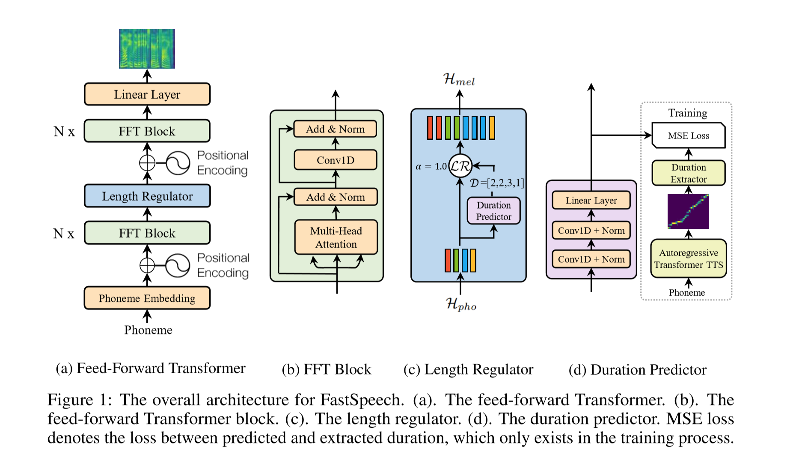
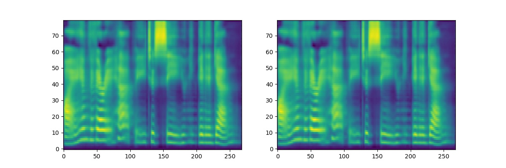

# FastSpeech-Pytorch
The Implementation of FastSpeech Based on Pytorch.

## Update
### 2019/10/23
1. Fix bugs in alignment;
2. Fix bugs in transformer;
3. Fix bugs in LengthRegulator;
4. Change the way to process audio;
5. Use waveglow to synthesize.

## Model

## My Blog
- [FastSpeech Reading Notes](https://zhuanlan.zhihu.com/p/67325775)
- [Details and Rethinking of this Implementation](https://zhuanlan.zhihu.com/p/67939482)

## Start
### Dependencies
- python 3.6
- CUDA 10.0
- pytorch==1.1.0
- nump==1.16.2
- scipy==1.2.1
- librosa==0.6.3
- inflect==2.1.0
- matplotlib==2.2.2

### Prepare Dataset
1. Download and extract [LJSpeech dataset](https://keithito.com/LJ-Speech-Dataset/).
2. Put LJSpeech dataset in `data`.
3. Unzip `alignments.zip` \*
4. Put [Nvidia pretrained waveglow model](https://drive.google.com/file/d/1WsibBTsuRg_SF2Z6L6NFRTT-NjEy1oTx/view?usp=sharing) in the `waveglow/pretrained_model`;
5. Run `python preprocess.py`.

*\* if you want to calculate alignment, don't unzip alignments.zip and put [Nvidia pretrained Tacotron2 model](https://drive.google.com/file/d/1c5ZTuT7J08wLUoVZ2KkUs_VdZuJ86ZqA/view?usp=sharing) in the `Tacotron2/pretrained_model`*

## Training
Run `python train.py`.

## Test
Run `python synthesis.py`.

## Pretrained Model
- Baidu: [Step:112000](https://pan.baidu.com/s/1by3-8t3A6uihK8K9IFZ7rg) Enter Code: xpk7
- OneDrive: [Step:112000](https://1drv.ms/u/s!AuC2oR4FhoZ29kriYhuodY4-gPsT?e=zUIC8G)

## Notes
- In the paper of FastSpeech, authors use pre-trained Transformer-TTS to provide the target of alignment. I didn't have a well-trained Transformer-TTS model so I use Tacotron2 instead.
- The examples of audio are in `results`.
- The outputs and alignment of Tacotron2 are shown as follows (The sentence for synthesizing is "I want to go to CMU to do research on deep learning."):

- The outputs of FastSpeech and Tacotron2 (Right one is tacotron2) are shown as follows (The sentence for synthesizing is "Printing, in the only sense with which we are at present concerned, differs from most if not from all the arts and crafts represented in the Exhibition."):

## Reference
- [The Implementation of Tacotron Based on Tensorflow](https://github.com/keithito/tacotron)
- [The Implementation of Transformer Based on Pytorch](https://github.com/jadore801120/attention-is-all-you-need-pytorch)
- [The Implementation of Transformer-TTS Based on Pytorch](https://github.com/xcmyz/Transformer-TTS)
- [The Implementation of Tacotron2 Based on Pytorch](https://github.com/NVIDIA/tacotron2)
