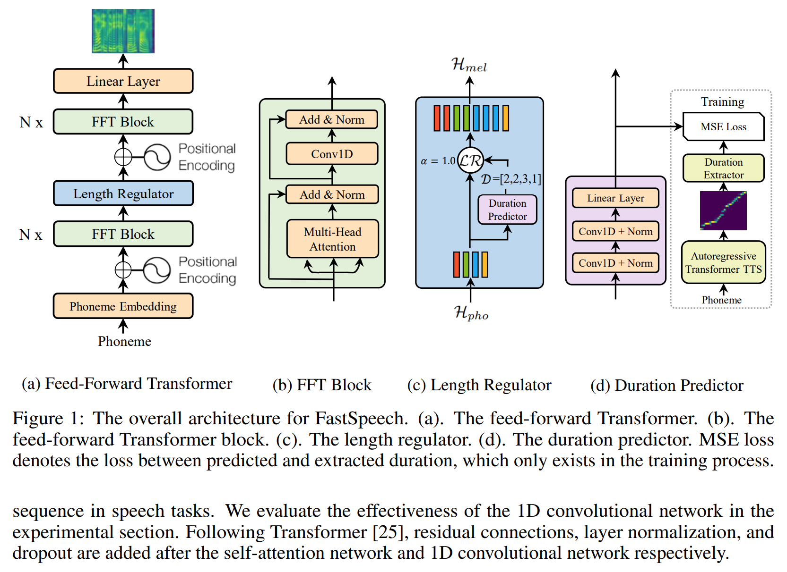

# FastSpeech-Pytorch
The Implementation of FastSpeech Based on Pytorch.

## Update (2020/07/20)
1. Optimize the training process.
2. Optimize the implementation of length regulator.
3. Use the same hyper parameter as FastSpeech2.
4. **The measures of the 1, 2 and 3 make the training process 3 times faster than before.**
5. **Better speech quality.**

## Model

    

## My Blog
- [FastSpeech Reading Notes](https://zhuanlan.zhihu.com/p/67325775)
- [Details and Rethinking of this Implementation](https://zhuanlan.zhihu.com/p/67939482)

## Prepare Dataset
1. Download and extract [LJSpeech dataset](https://keithito.com/LJ-Speech-Dataset/).
2. Put LJSpeech dataset in `data`.
3. Unzip `alignments.zip`.
4. Put [Nvidia pretrained waveglow model](https://drive.google.com/file/d/1WsibBTsuRg_SF2Z6L6NFRTT-NjEy1oTx/view?usp=sharing) in the `waveglow/pretrained_model` and rename as `waveglow_256channels.pt`;
5. Run `python3 preprocess.py`.

## Training
Run `python3 train.py`.

## Evaluation
Run `python3 eval.py`.

## Notes
- In the paper of FastSpeech, authors use pre-trained Transformer-TTS model to provide the target of alignment. I didn't have a well-trained Transformer-TTS model so I use Tacotron2 instead.
- I use the same hyper-parameter as [FastSpeech2](https://arxiv.org/abs/2006.04558).
- The examples of audio are in `sample`.
- [pretrained model](https://drive.google.com/file/d/1vMrKtbjPj9u_o3Y-8prE6hHCc6Yj4Nqk/view?usp=sharing).

## Reference

### Repository
- [The Implementation of Tacotron Based on Tensorflow](https://github.com/keithito/tacotron)
- [The Implementation of Transformer Based on Pytorch](https://github.com/jadore801120/attention-is-all-you-need-pytorch)
- [The Implementation of Transformer-TTS Based on Pytorch](https://github.com/xcmyz/Transformer-TTS)
- [The Implementation of Tacotron2 Based on Pytorch](https://github.com/NVIDIA/tacotron2)
- [The Implementation of FastSpeech2 Based on Pytorch](https://github.com/ming024/FastSpeech2)

### Paper
- [Tacotron2](https://arxiv.org/abs/1712.05884)
- [Transformer](https://arxiv.org/abs/1706.03762)
- [FastSpeech](https://arxiv.org/abs/1905.09263)
- [FastSpeech2](https://arxiv.org/abs/2006.04558)