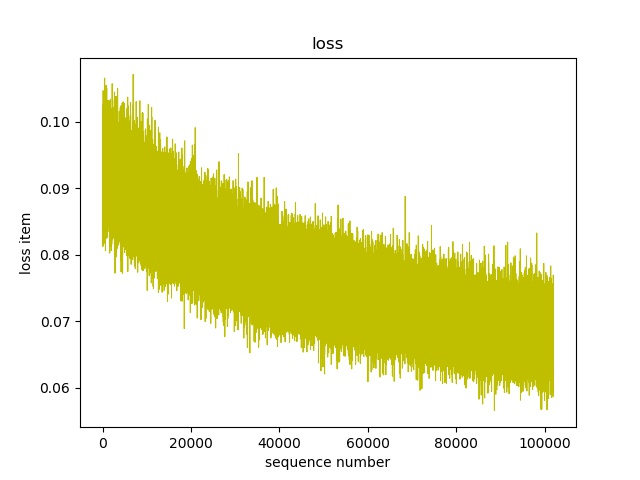

# New
Modifying...

# Old

# FastSpeech-Pytorch
The Implementation of FastSpeech Based on Pytorch.

## Model
<div align="center">

</div>

## My Blog
- [FastSpeech Reading Notes](https://zhuanlan.zhihu.com/p/67325775)
- [Details and Rethinking of this Implementation](https://zhuanlan.zhihu.com/p/67939482)

## Start
### Dependencies
- python 3.6
- CUDA 10.0
- pytorch 1.1.0
- numpy 1.16.2
- scipy 1.2.1
- librosa 0.6.3
- inflect 2.1.0
- matplotlib 2.2.2

### Prepare Dataset
1. Download and extract [LJSpeech dataset](https://keithito.com/LJ-Speech-Dataset/).
2. Put LJSpeech dataset in `data`.
3. Run `preprocess.py`.

### Get Alignment from Tacotron2
#### Note
In the paper of FastSpeech, authors use pre-trained Transformer-TTS to provide the target of alignment. I didn't have a well-trained Transformer-TTS model so I use Tacotron2 instead.

#### Calculate Alignment during Training (slow)
Change `pre_target = False` in `hparam.py`

#### Calculate Alignment before Training
1. Download the pre-trained Tacotron2 model published by NVIDIA [here](https://drive.google.com/uc?export=download&confirm=XAHL&id=1c5ZTuT7J08wLUoVZ2KkUs_VdZuJ86ZqA).
2. Put the pre-trained Tacotron2 model in `Tacotron2/pre_trained_model`
3. Run `alignment.py`, it will spend 7 hours training on NVIDIA RTX2080ti.

#### Use Calculated Alignment (quick)
I provide LJSpeech's alignments calculated by Tacotron2 in `alignment_targets.zip`. If you want to use it, just unzip it.

## Run (Support Data Parallel)
### Note
In the turbo mode, a prefetcher prefetches training data and this operation may cost more memory.

### Normal Mode
Run `train.py`.

### Turbo Mode
Run `train_accelerated.py`.

## Test
### Synthesize
Run `synthesis.py`.

### Results
- The examples of audio are in `results`. The sentence for synthesizing is "I am very happy to see you again.". `results/normal.wav` was synthesized when `alpha = 1.0`, `results/slow.wav` was synthesized when `alpha = 1.5` and `results/quick.wav` was synthesized when `alpha = 0.5`.
- The outputs and alignment of Tacotron2 are shown as follows (The sentence for synthesizing is "I want to go to CMU to do research on deep learning."):
<div align="center">

</div>

- The outputs and alignment of FastSpeech are shown as follows (The sentence for synthesizing is "I want to go to CMU to do research on deep learning."):
<div align="center">

</div>

### Loss Curve
The total_loss curve recorded from 30000th step to 140000th step is shown as follows:
<div align="center">

</div>

## Notes
- If you want to use another model to get alignments, you need rewrite `alignment.py`.
- The returned value of `alignment.py` is a tensor whose value is the multiple that encoder's outputs are supposed to be expanded by. For example: 
```python
test_target = torch.stack([torch.Tensor([0, 2, 3, 0, 3, 2, 1, 0, 0, 0]),
                           torch.Tensor([1, 2, 3, 2, 2, 0, 3, 6, 3, 5])])
```
- The output of LengthRegulator's last linear layer passes through the ReLU activation function in order to remove negative values. It is the outputs of this module. During the inference, the output of LengthRegulator pass through `torch.exp()` and subtract one, as the multiple for expanding encoder output. During the training stage, duration targets add one and pass through `torch.log()` and then calculate loss. For example:
```python
duration_predictor_target = duration_predictor_target + 1
duration_predictor_target = torch.log(duration_predictor_target)

duration_predictor_output = torch.exp(duration_predictor_output)
duration_predictor_output = duration_predictor_output - 1
```


## Reference
- [The Implementation of Tacotron Based on Tensorflow](https://github.com/keithito/tacotron)
- [The Implementation of Transformer Based on Pytorch](https://github.com/jadore801120/attention-is-all-you-need-pytorch)
- [The Implementation of Transformer-TTS Based on Pytorch](https://github.com/xcmyz/Transformer-TTS)
- [The Implementation of Tacotron2 Based on Pytorch](https://github.com/NVIDIA/tacotron2)
